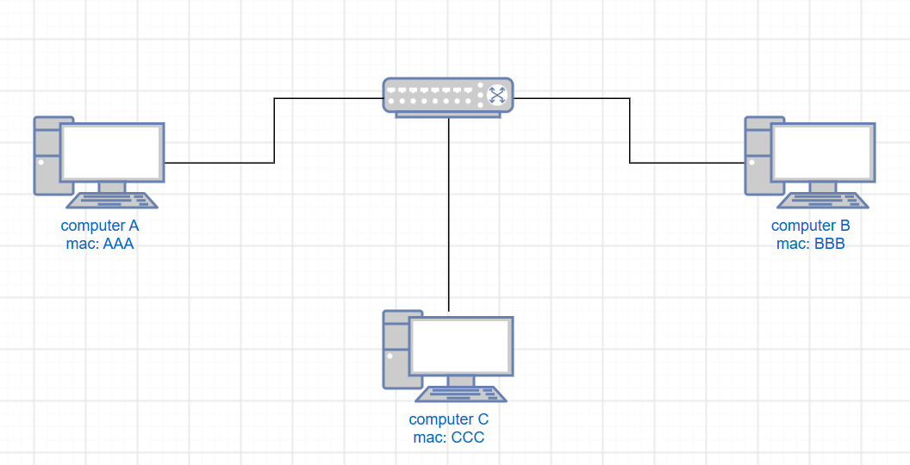
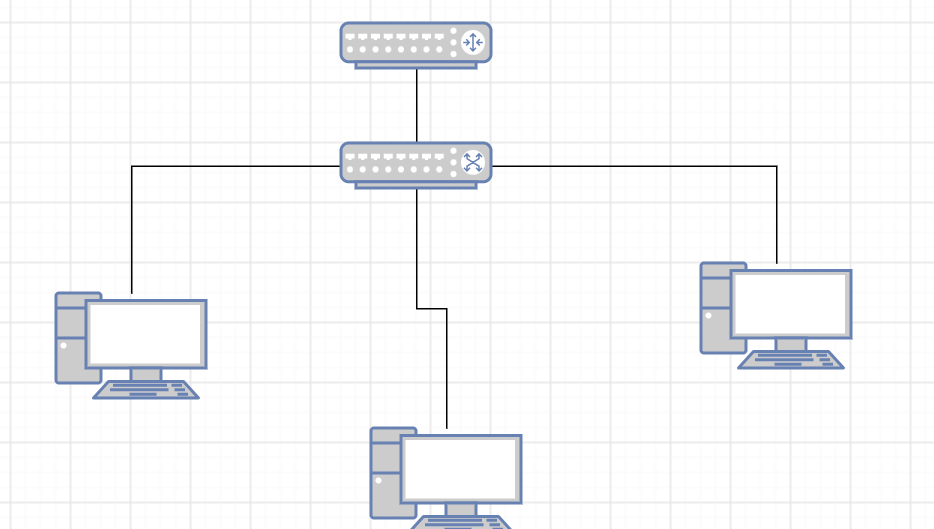

1. Схема mac-адресов

2. Схема компутеров с коммункаторов

3. Ошибки

1) Дублирование mac-адреса
Два устройства с одним и тем же mac-адресом.
Чтобы исправить, найти оба и сменить на одном из них.

2) Поврежденный кабель
Нет соединения, скорость интернета многа меньше чем должна быть.
Чтобы исправить, заменить кабель на заведомо рабочий.

3) Переполнение mac-таблицы
Слишком много устройств - таблица заполнена.
Чтобы исправить, увеличить размер таблицы