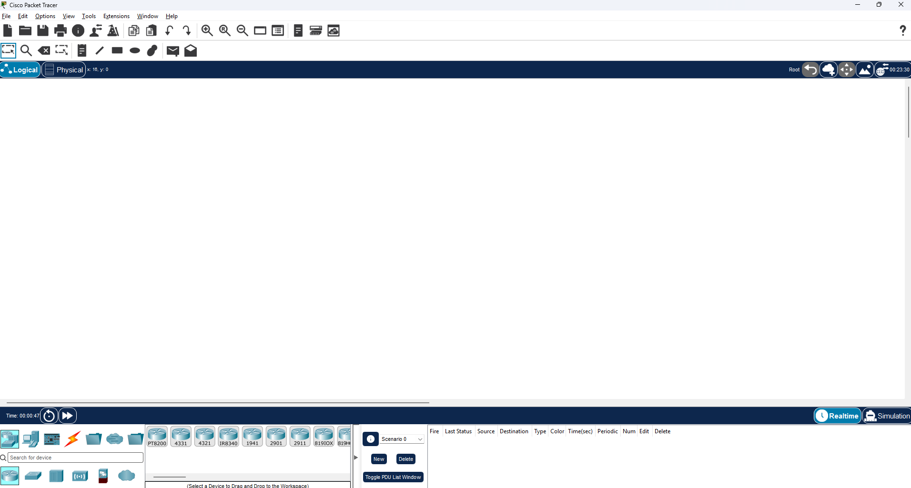

Рабочий Cisco

Задание 1
Разделить сеть 127.168.0.0/27 на 5 подсетей

1 подсеть
Адрес: 127.168.0.0/27
Диапозон: 127.168.0.1 – 127.168.0.30
Широковещательный: 127.168.0.31
Маска: 255.255.255.224

2 подсеть
Адрес: 127.168.0.32/27
Диапозон: 127.168.0.33 – 127.168.0.62
Широковещательный: 127.168.0.63
Маска: 255.255.255.224

3 подсеть
Адрес: 127.168.0.64/27
Диапозон: 127.168.0.65 – 127.168.0.94
Широковещательный: 127.168.0.95
Маска: 255.255.255.224

4 подсеть
Адрес: 127.168.0.96/27
Диапозон: 127.168.0.97 – 127.168.0.126
Широковещательный: 127.168.0.127
Маска: 255.255.255.224

5 подсеть
Адрес: 127.168.0.128/27
Диапозон: 127.168.0.129 – 127.168.0.158
Широковещательный: 127.168.0.159
Маска: 255.255.255.224

Задание 2
​Найти нужную длину для /* для 20 подсетей и 10 узлов​

Ответ:
Нету нужной. Для 20 подсетей надо использовать префикс /29, но у него всего 6 узлов.
Для 10 узлов префикс /28, но у него слишком мало подсетей (16).